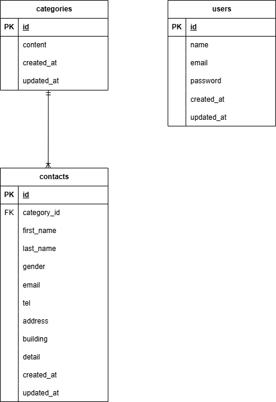

#coachtech お問い合わせフォーム

##環境構築

###Dockerビルド
・docker-compose up -d --build

###Laravel環境構築
・docker-compose exec php bash
・composer install
・cp .env.example .env
・php artisan key:generate
・php artisan migrate
・php artisan db:seed

##開発環境
・お問い合わせ画面：http://localhost/
・管理画面：http://localhost/admin
・phpMyAdmin：http://localhost:8080

##使用技術（実行環境）
・PHP 8.2.11
・Laravel 8.83.8
・jQuery 3.7.1
・MySQL 8.0.26
・nginx 1.21.1

##ER図

# coachtech-contact-form
